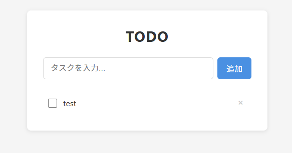

# test-claude-code

[English](./docs/lang/en.md) | 日本語

## 概要

バニラHTML/CSS/JavaScriptで実装したシンプルなTODOアプリ。フレームワーク不使用で、LocalStorageによるデータ永続化に対応している。

### デプロイ

<https://kazuakikuji.github.io/test-claude-code/>

### アプリ画像



## 背景

Claude Codeを用いた開発フローの検証を目的として作成したサンプルリポジトリ。シンプルなTODOアプリを題材に、計画立案からコーディング・コミットまでの一連の作業を試している。

## 主な処理の流れ

1. ページ読み込み時に`loadTodos()`でLocalStorageからTODO一覧を復元する
2. ユーザーがフォームを送信（または Enter キーを押す）すると`addTodo()`でTODOを追加する
3. チェックボックスまたはテキストをクリックすると`toggleTodo()`で完了/未完了を切り替える
4. `×`ボタンをクリックすると`deleteTodo()`でTODOを削除する
5. 状態が変わるたびに`saveTodos()`でLocalStorageへ保存し、`renderTodos()`でDOMを更新する

## セットアップ

### 1. リポジトリのクローン

```bash
git clone https://github.com/KazuakiKuji/test-claude-code.git
cd test-claude-code
```

### 2. ファイル構成の確認

サーバー不要。以下の3ファイルがあれば動作する。

```text
test-claude-code/
├── index.html   # UIマークアップ
├── style.css    # スタイル
└── script.js    # ロジック (CRUD + LocalStorage)
```

## 実行方法

### 手動実行

`index.html` をブラウザで直接開く。

```bash
# Linux / macOS
open index.html

# Windows
start index.html
```

または VSCode の Live Server 拡張などを使ってローカルサーバー経由で開いても動作する。

## よくあるエラー

### TODOを追加してもリストに表示されない

`script.js` の読み込みに失敗している可能性がある。ブラウザの開発者ツール（F12）でコンソールエラーを確認し、ファイルパスが正しいか確認する。

### ページをリロードするとTODOが消える

ブラウザのプライベート/シークレットモードではLocalStorageが無効になる場合がある。通常モードで開き直すことで解決する。
